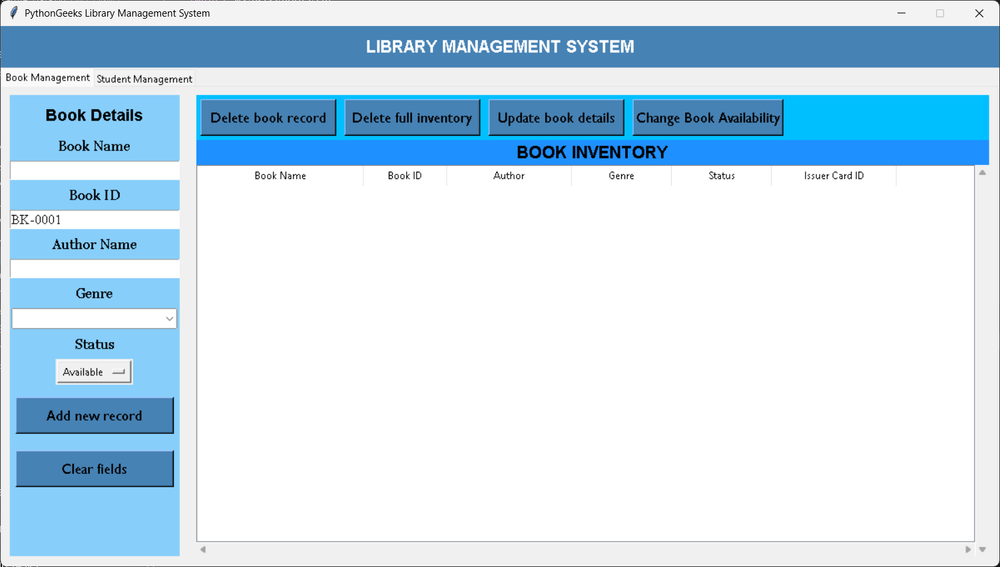
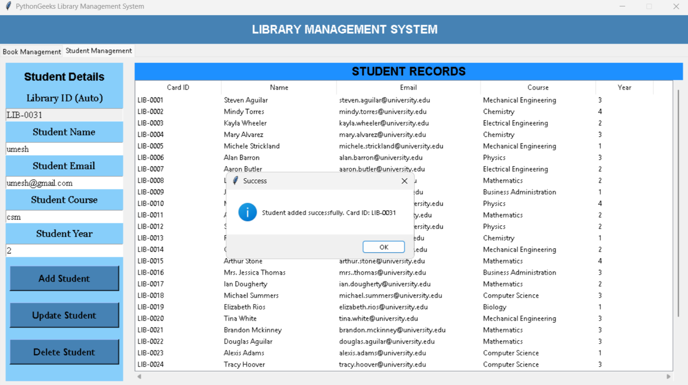

# 📚 Library Management System (MySQL + Python)

A simple **Library Management System** built with **Python** and **MySQL**, using the `Faker` library to auto-generate mock data for students and books.

---

## 🚀 Features

- Generate fake **student** and **book** records easily.
- Assign books to students with random issuance.
- Fully integrated with MySQL for data persistence.
- Uses `.env` file for secure credential management.
- Clean and simple interface demonstrating library data.

---

## 🛠️ Prerequisites

Make sure you have the following installed:

- Python 3.x
- MySQL Server
- Required Python libraries:

```bash
pip install mysql-connector-python faker python-dotenv
````

---

## 🧱 Database Setup

Create a MySQL database named `librarydb`:

```sql
CREATE DATABASE librarydb;
```

Create the necessary tables:

```sql
USE librarydb;

CREATE TABLE Students (
    Card_ID VARCHAR(10) PRIMARY KEY,
    Name VARCHAR(100),
    Email VARCHAR(100),
    Course VARCHAR(100),
    Year INT
);

CREATE TABLE Library (
    BK_ID VARCHAR(10) PRIMARY KEY,
    BK_NAME VARCHAR(100),
    AUTHOR_NAME VARCHAR(100),
    GENRE VARCHAR(100),
    BK_STATUS VARCHAR(20),
    CARD_ID VARCHAR(10)
);
```

---

## 🔐 Environment Variables

Store database credentials securely in a `.env` file at the project root:

```env
DB_HOST=localhost
DB_USER=root
DB_PASSWORD=your_mysql_password
DB_NAME=librarydb
```

> **Warning:** Never commit your `.env` file to a public repository!

---

## 📂 File Structure

```
your_project/
├── main.py
├── .env
├── README.md
└── screenshots/
    ├── main_interface_empty.png
    ├── add_book_highlighted.png
    ├── add_student_success.png
    ├── main_interface_with_data.png
    └── adding_book.png
```

---

## ▶️ How to Run

```bash
python main.py
```

This will:

* Clear existing records in `Students` and `Library`.
* Generate 30 fake students.
* Generate 50 fake books (some marked as "Issued").
* Populate your database with this data.

---

## 🖼️ Screenshots

### Initial interface (empty data)



### After adding a book (highlighted)


### Student added confirmation



### Interface with full data


---

## 🙌 Contributions

Feel free to fork, improve, or adapt this project. Pull requests and suggestions are welcome!

---

## 🧠 Notes

* Faker generates random data on every run.
* Ensure your MySQL server is running before starting.
* Use the `.env` file to keep your credentials safe.
* Check your table names and credentials if errors occur.

---

## 📬 Contact

Created by **Uday Kumar** — feel free to reach out with suggestions or issues!

```

---

This is ready to drop into your `README.md` file and it will display perfectly on GitHub or any markdown viewer.

If you want, I can help you add badges or a troubleshooting section next!
```
